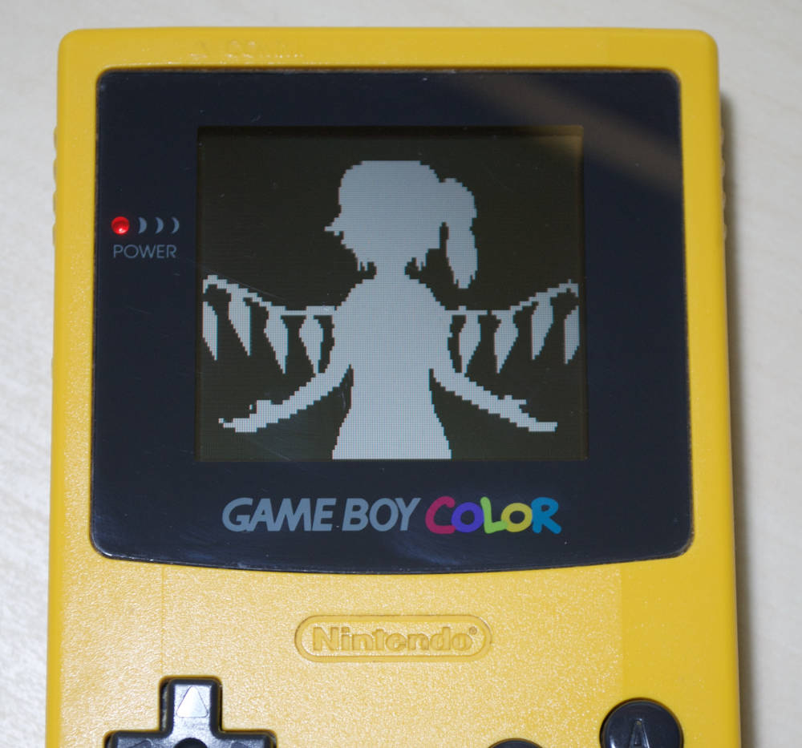

# DMG Bad Apple AV

**GameBoy 30 FPS 160x72 (stretched) B/W Video Player**

<p align="center">

</p>

This is a video player for the GameBoy (DMG, CGB and AGB) which is able to play
several minutes of black and white video with a maximum resolution of 160x72
(stretched vertically to fill the screen), streamed from the cartridge.
The video player engine is also able to simultaneously accomodate for 3-bit
stereo sound.

Of course this is yet another implementation of a Bad Apple demo for the
GameBoy -- hopefully a sufficiently unique one as at least three have been
developed at the time I am writing this (two for DMG, and one for CGB).

### [Download Here!](https://github.com/shysaur/dmg-badapple-av/releases/download/release_1.0.0/badapple-av_30fps_72p_3bitsnd.gb)

You can download more (smaller) pre-built ROMs from the
[releases section](https://github.com/shysaur/dmg-badapple-av/releases).

## History

The original work for this demo was done in 2016, but I couldn't get the music
part sorted. In 2022 I realized there were enough CPU cycles available to
handle sound output with the same approach as
https://github.com/LIJI32/GBVideoPlayer2. In 2023 I finally managed to test
the demo on real hardware (a CGB) and I was extremely pleased to discover it
works perfectly without changes, so I finally can release this!

### Variants

Three other branches in the repo contain older versions which work slightly
differently:

- `chiptune_snd` does not have the 3-bit stereo sampled sound, it uses
  a conventional sound playback engine. The sound track being played has nothing
  to do with the Bad Apple demo however.
  
  The code of this version is much less messy and it could be integrated in a
  game with relative ease. The latest version intentionally doesn't save
  CPU register state in interrupts, so the main thread is off limits.
  
- `no_snd` doesn't have any sound playback facilities.
  
- `sampled_snd_4bit` is an experimental version that uses the wave channel
  (channel 3) for sound playback. However it doesn't work very well.

## How it works

The key observation that makes this demo possible is that -- with no sprites
and tile-aligned scrolling -- there are cumulatively 11364 CPU cycles (T states)
available each frame for writing to VRAM. Considering that the GameBoy CPU takes
6 cycles to move a byte from ROM to RAM with the "standard" instruction sequence

```
ld a,[de]
ld [hl+],a
inc de
```

there is enough time each frame to move 1894 bytes. A 160x72 1bpp image is
1440 bytes in size, so if we spend all of our time copying bytes we have enough
CPU time to play 60 FPS video at this resolution. Of course we also want to
have audio playback, and not use too much ROM for the video (at 60 FPS the Bad
Apple video uncompressed would be about 18 MB in size...) so a reasonable
compromise is to aim for 30 FPS video.

The GameBoy has 6144 bytes of VRAM allocated for character tiles, so we can fit
4 complete 160x72 images in it, allowing us to double-buffer each video frame
and completely avoid tearing.

### The render loop

If we aim for 30 FPS video, the CPU has two full 60 Hz frames of time to upload
a new video frame to VRAM. The GameBoy always uses 2bpp tiles, however, so we
need to use some tricks to display a 1bpp image without wasting any extra
bytes. I decided use a single bit plane per video frame, as a result the
rendering code uploads two frames simultaneously, taking 4 frames of time to
do it. The frame currently being shown can be changed simply by changing the
current BGP palette.

So, putting everything together, the video rendering works on 8 frame cycles
like this:

- Frames 1, 2: Upload part 1 of frame pair 2, show plane 1 of frame pair 1
- Frames 3, 4: Upload part 2 of frame pair 2, show plane 2 of frame pair 1
- Frames 5, 6: Upload part 1 of frame pair 1, show plane 1 of frame pair 2
- Frames 7, 8: Upload part 2 of frame pair 1, show plane 2 of frame pair 2

The frame upload is done partially in VBlank and partially in HBlank.
Sound playback is implemented by updating the master volume register (NR50)
at every HBlank interval. To ensure sound still plays during VBlank, the timer
interrupt is temporarily enabled for its duration.

### Video compression

To ensure the amount of ROM space taken by the video is reasonable, the player
uses a delta compression scheme that allows for streaming decompression without
employing any additional buffer in RAM. A frame pair (metaframe) can either be
compressed or uncompressed. 

Uncompressed frames are just the raw bytes of the frame.
Compressed frames are a sequence of 4 byte words that consist of an offset byte
followed by 3 bytes of actual frame data. The offset byte is just the amount
of bytes to skip before copying the 3 following bytes.

Since the VRAM upload kernel writes over the previous frame pair -- not the
one currently displayed -- the difference skips one frame pair, making it
suboptimal. However it still decreases ROM size considerably. Since it is
always possible to fallback to a full frame pair transfer, the compression is
fully lossless.

The entire Bad Apple video frame data is just 2.7 MB, while the audio alone is
almost exactly 2 MB, totaling 4.7MB. There is just 0.7 MB of video data which
bumps the ROM size to 8 MB, a fact that bothers me a little...
To allow for smaller ROMs, the player also supports:
- reducing the frame rate by an arbitrary (possibly fractional) amount
- reducing the resolution, with two possible configurations (in addition to the
  default 160x72): 160x64 and 160x56. *Note:* only 160x72 is tested for the
  version with audio at the moment.
However with smaller video and less frames per second it's less impressive...

## TODO list

With improved video compression and by introducing audio compression it should
be possible to compress the AV data enough to fit the entire Bad Apple video in
4 MB.

To implement this, we need to get the cycles to handle the more complex
compression somewhere. One approach would be to change the render loop to *not*
use interrupts for HBlank/VBlank synchronization, to avoid interrupt enter/exit
overhead.

More cycle saving could be obtained by interleaving audio and video
data, which also requires re-engineering the compression tools a bit. Using
a single stream for both audio and video allows us to halve bank-switching
overhead (the current version switches bank at each HBlank!)
